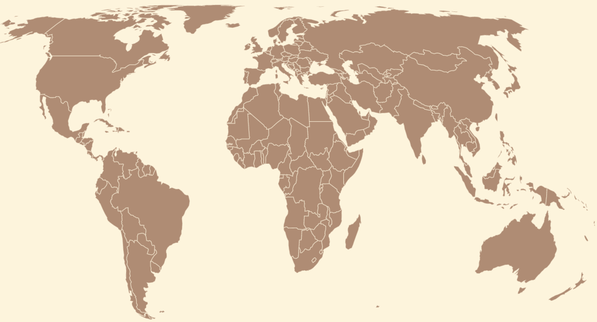
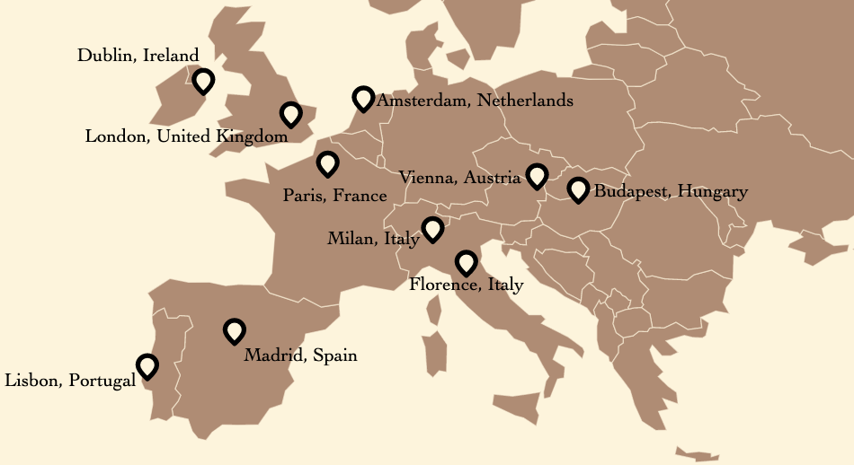
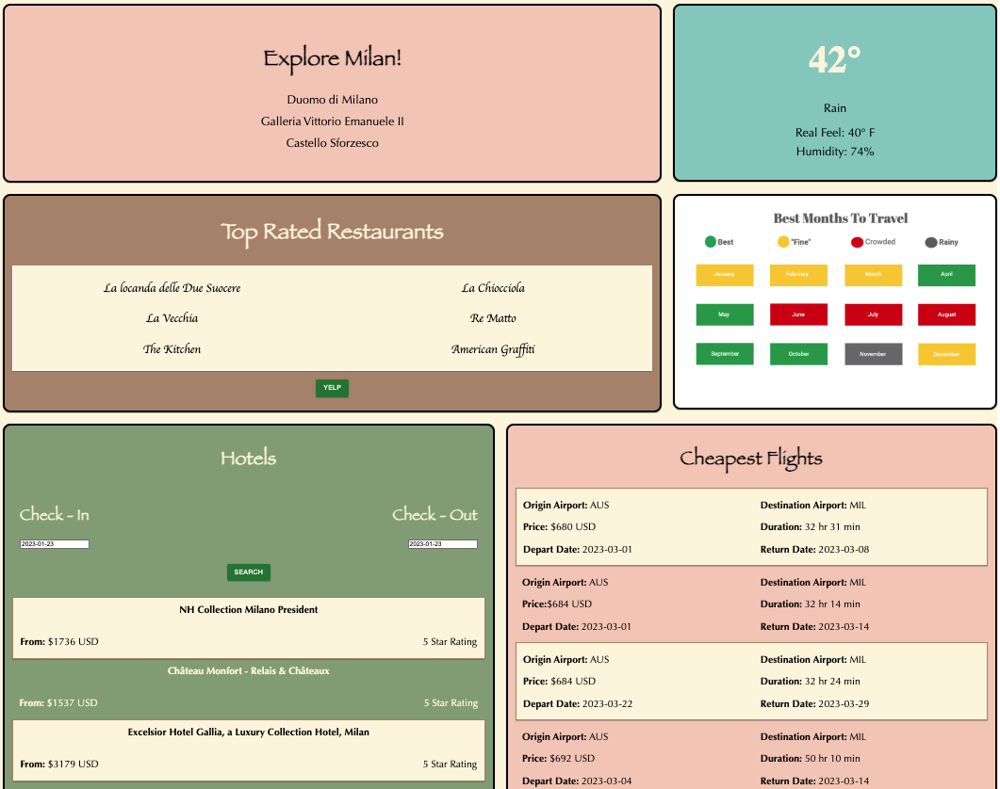

# <h1 align="center" style="font-size: 100">Wanderlust</h1>

<!-- ABOUT -->
# About The Project

This web application allows travelers to plan their trips to the world's most popular destinations. There are a total of 60 cities across 6 continents. The application consists of widgets inclusive of things to do, current weather, most popular restaurants, optimal months to visit, hotel pricing & cheapest available flights.

Some widgets also have a redirect button, which allows the user to further customize their travel plans.

(<a href="#top">back to top</a>)

<!-- GETTING STARTED -->
# Prerequisites
Many APIs do not support Cross-Origin Resource Sharing (CORS). Please use the following steps to enable a proxy:
*  Navigate to: https://cors-anywhere.herokuapp.com/.
*  Click "Request temporary access to the demo server."
*  Proceed below to Usage steps.

(<a href="#top">back to top</a>)

<!-- USAGE EXAMPLES -->
# Usage

1) Visit https://main.daeis2pek1dmf.amplifyapp.com/.
2) Click the continent you want to explore.
3) Click on the marker next to the destination you want to visit.
4) Explore each widget to plan your ideal itinerary.
5) Click the home button at the bottom of the page to explore another city.

(<a href="#top">back to top</a>)

# Screenshots:
 

 

(<a href="#top">back to top</a>)

<!-- BUILT WITH -->
### Built With

* [Next.JS](https://nextjs.org/)
* [React](https://reactjs.org/)
* [AWS Amplify](https://aws.amazon.com/amplify/)

### Third party APIs

* [OpenWeather](https://openweathermap.org/api)
* [Yelp Fusion](https://docs.developer.yelp.com/docs/getting-started)
* [Travelpayouts](https://travelpayouts.github.io/slate/)

(<a href="#top">back to top</a>)

<!-- CONTACT -->
# Contact

Email: jlukosecode@gmail.com

Project Repository: [https://github.com/jlucode/Wanderlust](https://github.com/jlucode/Wanderlust)

Website Link: [https://main.daeis2pek1dmf.amplifyapp.com/](https://main.daeis2pek1dmf.amplifyapp.com/)

(<a href="#top">back to top</a>)

